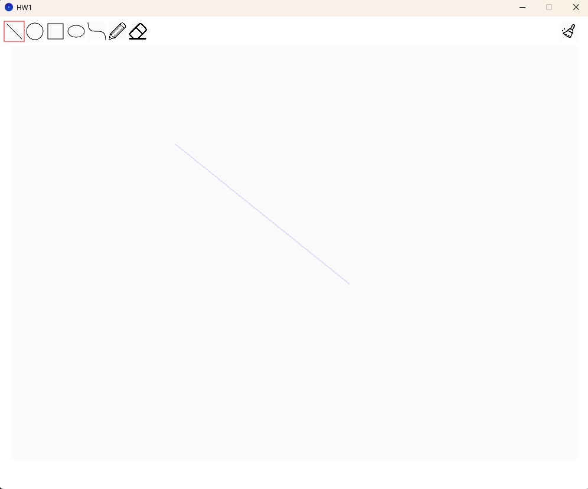
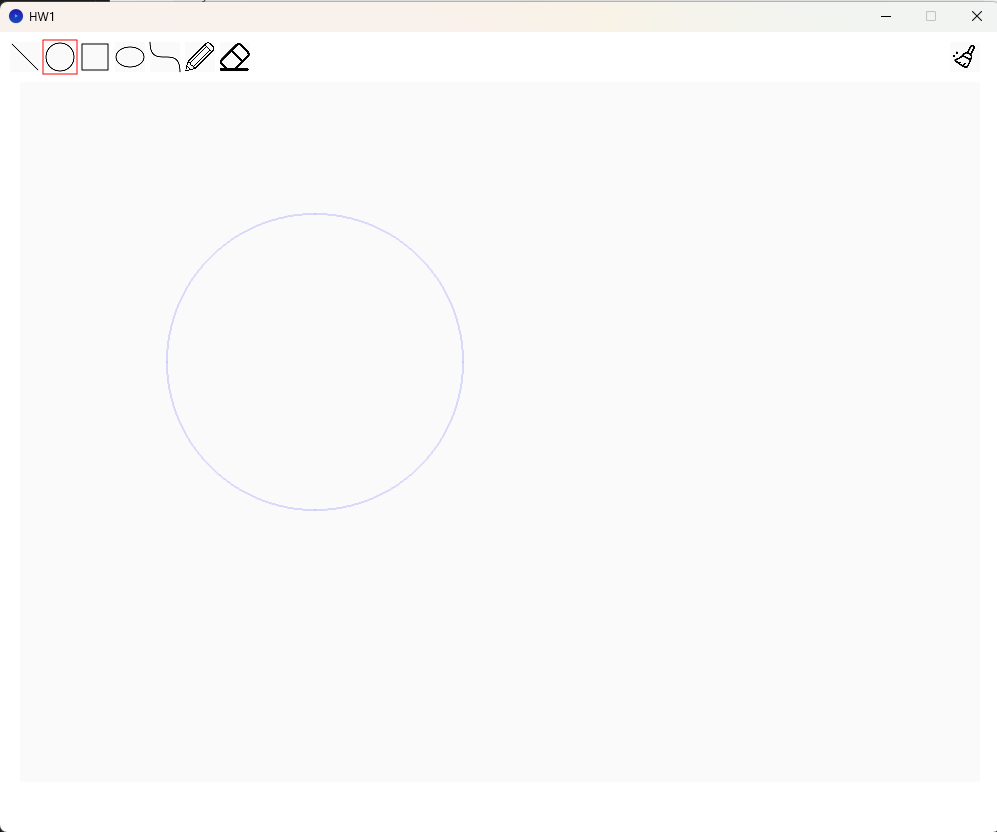
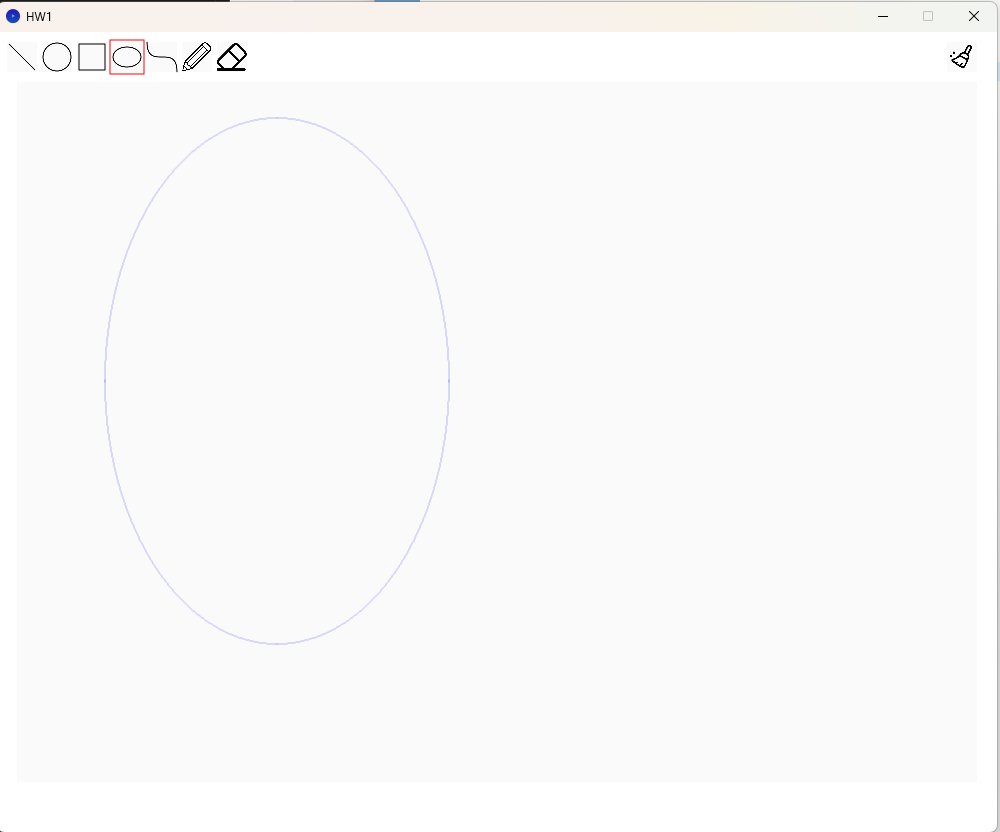
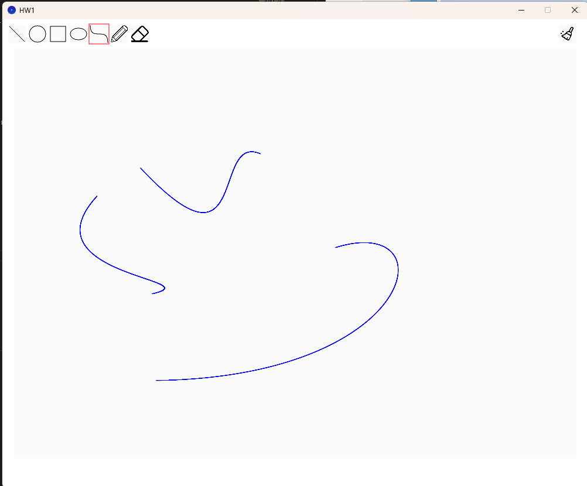
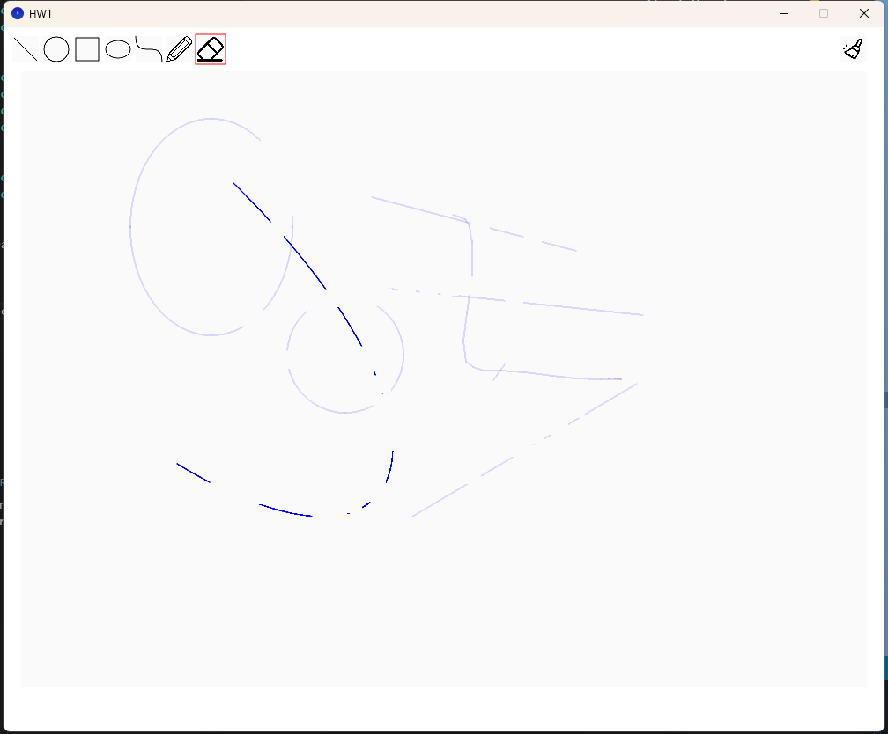

# HW1


##  Task completed

1. (25%) Correctly implement the line algorithm.
    


    The function is finished with the midpoint algorithm taught in class.
    And the implement is finished by LLM with following prompt
    :use the pixel array middle point algorithm to implement this Line drawing functin.
    ```java
    public void CGLine(float x1, float y1, float x2, float y2) {
      int xStart = Math.round(x1);
      int yStart = Math.round(y1);
      int xEnd   = Math.round(x2);
      int yEnd   = Math.round(y2);

      int dx = xEnd - xStart;
      int dy = yEnd - yStart;

      int sx = (dx >= 0) ? 1 : -1;
      int sy = (dy >= 0) ? 1 : -1;

      dx = Math.abs(dx);
      dy = Math.abs(dy);

      int x = xStart;
      int y = yStart;

      // Shallow slope (dx >= dy)
      if (dx >= dy) {
          int d = 2 * dy - dx;      // decision variable
          int incrE = 2 * dy;       // increment if choosing E
          int incrNE = 2 * (dy - dx); // increment if choosing NE
          drawPoint(x, y, color(255, 0, 0));
          for (int i = 0; i < dx; i++) {
              if (d <= 0) {
                  // choose E
                  d += incrE;
                  x += sx;
              } else {
                  // choose NE
                  d += incrNE;
                  x += sx;
                  y += sy;
              }
              drawPoint(x, y, color(0, 0, 255));
          }
      } 
      // Steep slope (dy > dx)
      else {
          int d = 2 * dx - dy;
          int incrN = 2 * dx;
          int incrNE = 2 * (dx - dy);
          drawPoint(x, y, color(0, 0, 255));
          for (int i = 0; i < dy; i++) {
              if (d <= 0) {
                  // choose N
                  d += incrN;
                  y += sy;
              } else {
                  // choose NE
                  d += incrNE;
                  x += sx;
                  y += sy;
              }
              drawPoint(x, y, color(0, 0, 255));
          }
      }
    }
    ```
2. (25%) Correctly implement the circle algorithm.
    

    The function is finished with the midpoint algorithm taught in class.
    And the implement is finished by LLM with following prompt
    :use the pixel array middle point algorithm to implement this circle drawing functin.
    ```java
    public void CGCircle(float x, float y, float r) {
      int xc = Math.round(x);
      int yc = Math.round(y);
      int radius = Math.round(r);

      int xk = 0;
      int yk = radius;

      // Decision variable
      int d = 1 - radius;

      while (xk <= yk) {
          // Plot the 8 symmetric points
          drawPoint(xc + xk, yc + yk, color(0, 0, 255)); // Octant 1
          drawPoint(xc - xk, yc + yk, color(0, 0, 255)); // Octant 2
          drawPoint(xc + xk, yc - yk, color(0, 0, 255)); // Octant 8
          drawPoint(xc - xk, yc - yk, color(0, 0, 255)); // Octant 7

          drawPoint(xc + yk, yc + xk, color(0, 0, 255)); // Octant 4
          drawPoint(xc - yk, yc + xk, color(0, 0, 255)); // Octant 3
          drawPoint(xc + yk, yc - xk, color(0, 0, 255)); // Octant 5
          drawPoint(xc - yk, yc - xk, color(0, 0, 255)); // Octant 6

          // Update decision variable
          if (d < 0) {
              d += 2 * xk + 3;
          } else {
              d += 2 * (xk - yk) + 5;
              yk--;
          }
          xk++;
      }
    }
    ```
    
3. (15%) Correctly implement the ellipse algorithm.
    

    The implement is finished by LLM with following prompt
    :use the Midpoint Ellipse Drawing algorithm to implement this circle drawing functin.
    ```java
    public void CGEllipse(float x, float y, float r1, float r2) {
      float r1_sq = r1 * r1;
      float r2_sq = r2 * r2;

      // --- Region 1 ---
      float px = 0;
      float py = r2;
      float p1 = r2_sq - r1_sq * r2 + 0.25f * r1_sq;

      // Plot initial points
      drawPoint(x + px, y + py, color(0, 0, 255));
      drawPoint(x - px, y + py, color(0, 0, 255));
      drawPoint(x + px, y - py, color(0, 0, 255));
      drawPoint(x - px, y - py, color(0, 0, 255));

      // Loop for the top part of the ellipse
      while (2 * r2_sq * px < 2 * r1_sq * py) {
        px++;
        if (p1 < 0) {
            p1 += 2 * r2_sq * px + r2_sq;
        } else {
            py--;
            p1 += 2 * r2_sq * px - 2 * r1_sq * py + r2_sq;
        }
        // Draw the four symmetric points
        drawPoint(x + px, y + py, color(0, 0, 255));
        drawPoint(x - px, y + py, color(0, 0, 255));
        drawPoint(x + px, y - py, color(0, 0, 255));
        drawPoint(x - px, y - py, color(0, 0, 255));
      }

      // --- Region 2 ---
      float p2 = r2_sq * (px + 0.5f) * (px + 0.5f) + r1_sq * (py - 1) * (py - 1) - r1_sq * r2_sq;

      // Loop for the side part of the ellipse
      while (py >= 0) {
        py--;
        if (p2 > 0) {
            p2 += -2 * r1_sq * py + r1_sq;
        } else {
            px++;
            p2 += 2 * r2_sq * px - 2 * r1_sq * py + r1_sq;
        }
        // Draw the four symmetric points
        drawPoint(x + px, y + py, color(0, 0, 255));
        drawPoint(x - px, y + py, color(0, 0, 255));
        drawPoint(x + px, y - py, color(0, 0, 255));
        drawPoint(x - px, y - py, color(0, 0, 255));
      }
    }

    ```
4. (15%) Correctly implement the curve algorithm.
      
      The follwing code is implement by LLM using the prompt
      : Following the previous use bezier curve algorithm to implement this function.
      ```java
      public void CGCurve(Vector3 p1, Vector3 p2, Vector3 p3, Vector3 p4) {
        int numSteps = 10000;

        for (int i = 0; i <= numSteps; i++) {
            // Calculate parameter t, which goes from 0.0 to 1.0
            float t = (float) i / numSteps;
            
            // Pre-calculate powers of t and (1-t)
            float one_minus_t = 1.0f - t;
            float t2 = t * t;
            float t3 = t2 * t;
            float one_minus_t2 = one_minus_t * one_minus_t;
            float one_minus_t3 = one_minus_t2 * one_minus_t;

            // Calculate the Bernstein basis polynomials
            float b1 = one_minus_t3;
            float b2 = 3 * t * one_minus_t2;
            float b3 = 3 * t2 * one_minus_t;
            float b4 = t3;

            // Calculate the point on the curve for the current value of t
            float x = b1 * p1.x + b2 * p2.x + b3 * p3.x + b4 * p4.x;
            float y = b1 * p1.y + b2 * p2.y + b3 * p3.y + b4 * p4.y;
            
            // Draw the calculated point
            drawPoint(x, y, color(0, 0, 255));
        }
      }
      ```
5. (20%) Correctly implement the eraser.
    
    
    The erase is just finished by creating a loop to draw point on the area to background color.
    But after using this funcion the program will **become laggy**, not knowing why.
    I've tested if using fill rect this won't happened.
    ```java
    public void CGEraser(Vector3 p1, Vector3 p2) {
      color c = color(250);
      for (float i = p1.x; i < p2.x; i+=0.5) {
        for (float j = p1.y; j < p2.y; j+=0.5) {
            drawPoint(i, j, c);
        }
      }
    }
    ```