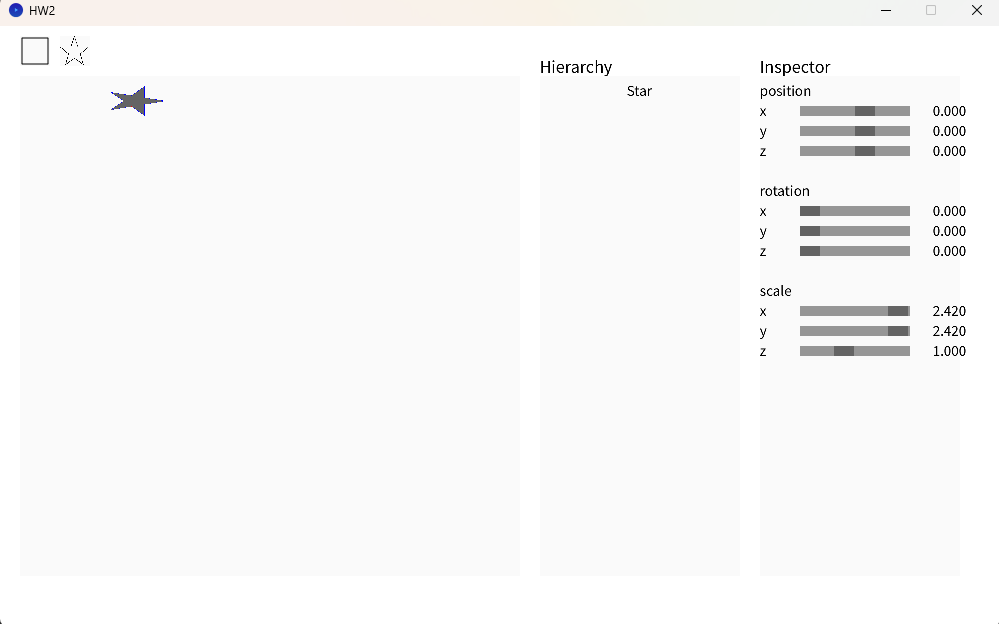
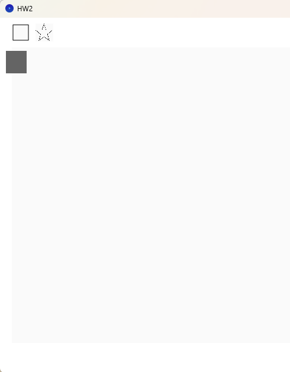

# HW2

> This assignment has a weird issue: I used the code from https://github.com/JCxYIS/ComputerGraphics_Yeh/tree/Lab2, but it doesn't behave like the demo shown in the documentation. The demo appears to be on a 2D plane, but the code seems to draw in 3D space.

##  (20%) Correctly implement the 3 transformation matrices.

This part is finished by just following the formula.
```java
  void makeRotZ(float a) {
    // TODO HW2
    // You need to implement the rotation of z-axis matrix here. (Yaw)
    makeIdentity();
      /*
    | cos(a)  -sin(a)  0  0 |
    | sin(a)   cos(a)  0  0 |
    |   0        0     1  0 |
    |   0        0     0  1 |
    */
    float c = (float)Math.cos(a);
    float s = (float)Math.sin(a);
    m[0]  = c;   m[1]  = -s;
    m[4]  = s;   m[5]  = c;
  }

  void makeTrans(Vector3 t) {
    // TODO HW2
    // You need to implement the translate matrix here.
    makeIdentity();
    m[3]  = t.x;
    m[7]  = t.y;
  }

  void makeScale(Vector3 s) {
    // TODO HW2
    // You need to implement the scale matrix here.
    makeIdentity();
    m[0]  = s.x;
    m[5]  = s.y;
  }
```

##  (25%) Correctly implement pnpoly.

This part is also done by following the formula I found on internet.
```java
boolean pnpoly(float x, float y, Vector3[] vertexes) {
  int n = vertexes.length;
  boolean inside = false;
  
  for (int i = 0, j = n - 1; i < n; j = i++) {
    float xi = vertexes[i].x;
    float yi = vertexes[i].y;
    float xj = vertexes[j].x;
    float yj = vertexes[j].y;
    
    // 判斷射線是否跨越邊界
    boolean intersect = ((yi > y) != (yj > y)) &&
                        (x < (xj - xi) * (y - yi) / (yj - yi) + xi);
    if (intersect) inside = !inside;
  }
  
  return inside;
}
```


##  (20%) Correctly implement the bounding box.

This part is done by a simple loop to check the {min, max}
```java
public Vector3[] findBoundBox(Vector3[] v) {
    if (v == null || v.length == 0) {
        return new Vector3[]{new Vector3(0, 0, 0), new Vector3(0, 0, 0)};
    }

    float minX = v[0].x;
    float minY = v[0].y;
    float maxX = v[0].x;
    float maxY = v[0].y;

    for (int i = 1; i < v.length; i++) {
        if (v[i].x < minX) {
            minX = v[i].x;
        }
        if (v[i].y < minY) {
            minY = v[i].y;
        }
        if (v[i].x > maxX) {
            maxX = v[i].x;
        }
        if (v[i].y > maxY) {
            maxY = v[i].y;
        }
    }

    Vector3 r1 = new Vector3(minX, minY, 0);
    Vector3 r2 = new Vector3(maxX, maxY, 0);

    return new Vector3[]{r1, r2};
}
```
##  (35%) Correctly implement Sutherland Hodgman Algorithm.

This part is finished completely with LLM with the prompt
:implement the sutherland hodgman algorithm for me.


These two image are with **same scaler**. Can confirm that the shape not rendering at the edge .


