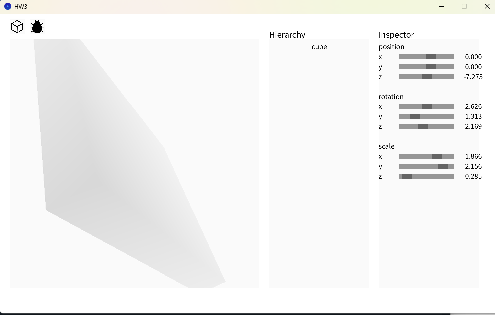
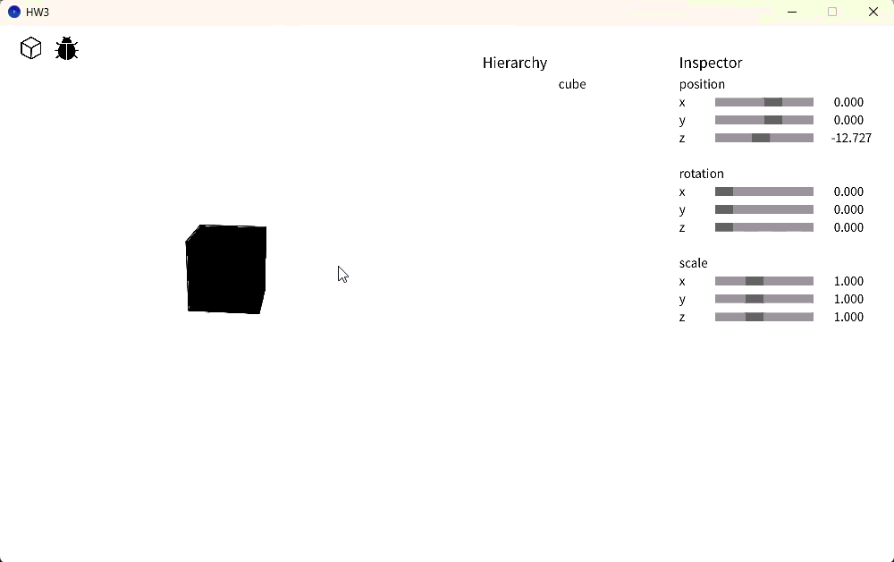
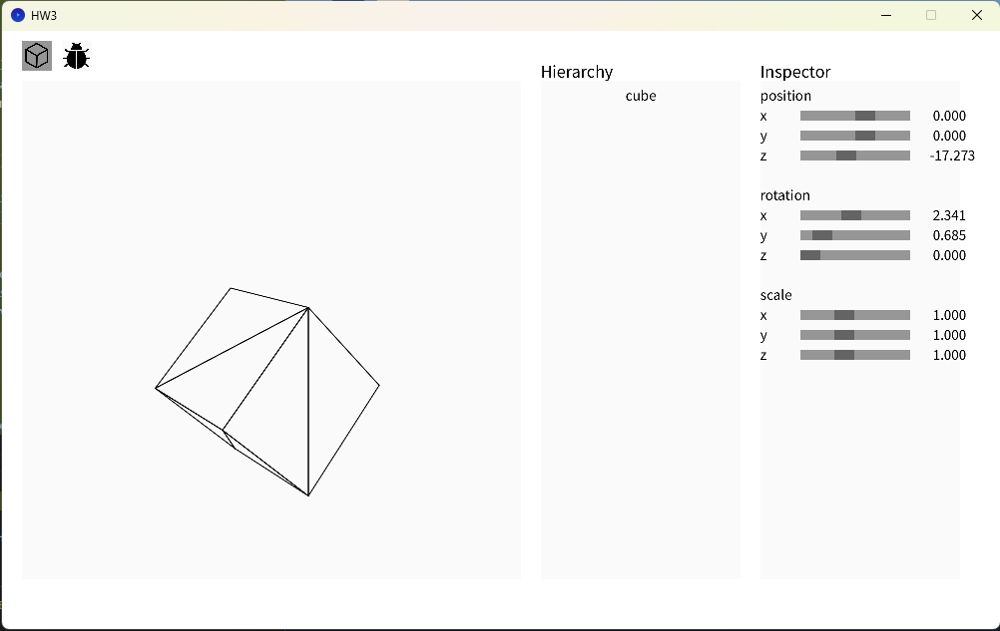

# HW3

> P.S. Most part of this homework is done by asking gemini how to implement certain algorithm.

##  (40%) Correctly implement the 3 matrices.

1. The rotation and transformation matrix is jsut copied from HW2
2. Camera Transformation (View Matrix)
3. Perspective Rendering (Projection Matrix)


##  (20%) Correctly implement depth buffer.
> The result might not be so obvious. Why?

> It might because the range of z value is not big enough.


##  (20%) Correctly implement camera control.


Use wasd to move the position and use mouse to adjust the angle.
##  (20%) Correctly implement backculling.



The following code is added into the drawDebug
```java
float ax = img_pos[1].x - img_pos[0].x;
float ay = img_pos[1].y - img_pos[0].y;
float bx = img_pos[2].x - img_pos[0].x;
float by = img_pos[2].y - img_pos[0].y;

// 2. Calculate the 2D Cross Product (Z-component)
// Formula: (x1 * y2) - (y1 * x2)
float crossProduct = ax * by - ay * bx;

// 3. Check Winding Order
// If the result is Negative (or Positive depending on your Y-axis setup), it is a backface.
// NOTE: If your model disappears completely, change '< 0' to '> 0'.
if (crossProduct < 0) { 
    continue; 
}

```